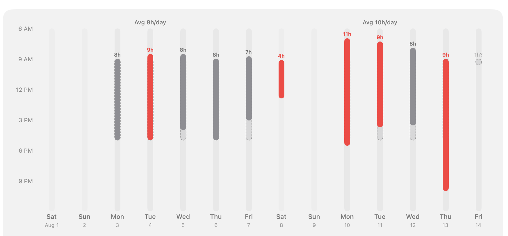

# Equilibrium

A macOS menu-free app that shows how many hours you've worked each day —
computed automatically from your Mac's sleep/wake activity, no manual
tracking required.



## Why

I felt like I was working too many hours at the same time I knew those
extra hours weren't producing fantastic extra output. I didn't feel
focused in my work. I wanted a way to make sure I didn't work too hard,
and that would also push me at the same time to be focused in my work.

Encouraging you to work the right number of hours both helps you to
focus and to relax, and to get the right work-life balance.

## How it works

- Tracks sleep/wake events in real time via IOKit power notifications
  (`IORegisterForSystemPower`) — no Full Disk Access required.  Events are
  persisted to disk so history accumulates across app restarts.
- Persists computed days to disk so history survives even after macOS
  rolls the underlying wake/sleep log off its own short retention window.
- Shows one week at a time, styled after Apple Health's activity charts —
  each day's bar spans its actual start-to-end time, scaled 6 AM–midnight,
  colored gray normally and red on weekends or any day over 8 hours.
- Step back through earlier weeks by swiping two fingers across the chart,
  with ⌘[ and ⌘], or with the arrows above it — weeks slide in from the
  side they sit on.
- Recommends how many hours to work on remaining days this week to land
  on a 40-hour week — filling at 8h/day until the budget's used up, or
  flagging when you're already over.
- Days can be manually edited, overridden, or deleted, with an optional
  30-minute-increment break duration subtracted from the displayed hours.
- Every day carries a morning intention (the sun above its bar) and an
  end-of-day check-in (the moon below it), filled in once written.  Click
  either — on any day, not just today — to edit it in a panel beside the
  chart, alongside that day's meetings.
- Follows the system's light/dark appearance automatically.
- Uses Apple's on-device LLM where it exists, but never depends on it: on
  macOS before 26, on Intel Macs, and with Apple Intelligence turned off,
  the weekly caption falls back to a plain stats sentence and work
  preferences are set with ordinary controls instead of free text.

## Requirements

- macOS 13.0+

## Permissions

Equilibrium runs in the **App Sandbox** and asks for as little as it can.

| Permission | Required? | Why |
|---|---|---|
| Calendar (full access) | Optional | Splits tracked time into meetings vs. focus.  Decline and the app still tracks hours; bars just aren't annotated with meetings. |
| Notifications | Optional | Daily intention / check-in reminders and the weekly summary. |
| Full Disk Access | **Never asked for** | Not used. |

Notes:

- Calendar access is **read-only in practice** — the app never creates or
  modifies events.  EventKit exposes no narrower read tier than "full access":
  the only alternative, write-only, cannot read events at all, so the wording
  of the macOS prompt is broader than what the app actually does.
- The sandbox confines all app data to
  `~/Library/Containers/com.alexcollins.Equilibrium/`.  The app has **no
  network entitlement** — the weekly caption is generated by the on-device
  FoundationModels LLM when that's available, so nothing leaves your Mac
  either way.

## Architecture: power-event collection

### Live tracking — IOKit

`PowerNotificationMonitor` registers with the root power domain via
`IORegisterForSystemPower`.  The kernel delivers callbacks on a Mach
notification port (added to the main run loop) for three message types:

| Message | Hex | Meaning |
|---|---|---|
| `kIOMessageCanSystemSleep` | `0xe0000270` | Idle-sleep gate — must acknowledge |
| `kIOMessageSystemWillSleep` | `0xe0000280` | Imminent sleep — must acknowledge |
| `kIOMessageSystemHasPoweredOn` | `0xe0000300` | Wake complete |

Both sleep messages are immediately acknowledged with `IOAllowPowerChange` so
the machine is never held up.  Each event is timestamped at the moment the
callback fires and appended to `LiveEventStore` (a small JSON file in
`~/Library/Application Support/WorkActivityTracker/live-events.json`), so
events persist across app restarts.  Events older than 30 days are pruned
automatically on every write.

### Why not `pmset -g log`?

Earlier versions shelled out to `pmset -g log` to backfill history from before
the app's first launch.  That required running **unsandboxed** (to spawn a
subprocess) and, in practice, Full Disk Access to read the whole log — a large
grant for a convenience feature.  The backfill was dropped in favour of the
sandbox: the chart now fills in from first launch onward as the machine sleeps
and wakes, and `WorkHistoryStore` keeps those days permanently.

### Why not `log show`?

`log show --predicate 'eventMessage contains "Wake"' --style syslog` can
surface the same kernel power events from the unified log, but requires the
`com.apple.private.logging.admin` private entitlement for anything beyond the
last few minutes — effectively the same or higher barrier than FDA.  IOKit
notifications are the correct public API for real-time power-state monitoring.

## Building

This project uses [XcodeGen](https://github.com/yonaskolb/XcodeGen) to
generate the Xcode project from `project.yml`:

```bash
xcodegen generate
xcodebuild -project Equilibrium.xcodeproj -scheme Equilibrium -configuration Release build
```
